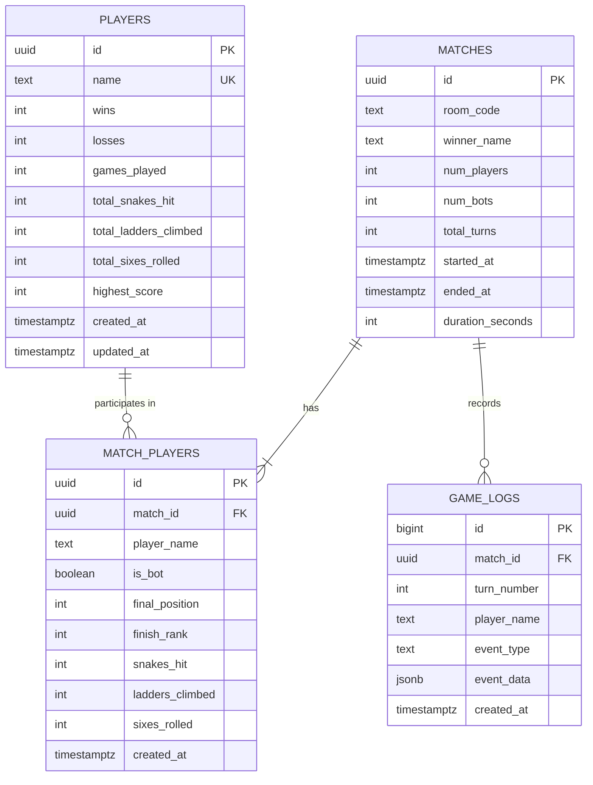

# 📊 Database Documentation

## Overview

Snake & Ladder uses **Supabase PostgreSQL** for persistent data storage. When Supabase is not configured, the app falls back to **localStorage** for offline play.

## Entity Relationship Diagram



## Tables

### `players`

Persistent player profiles that accumulate stats across games.

| Column | Type | Default | Description |
|--------|------|---------|-------------|
| `id` | UUID | auto | Primary key |
| `name` | TEXT | required | Player display name (unique, case-insensitive) |
| `wins` | INTEGER | 0 | Total first-place finishes |
| `losses` | INTEGER | 0 | Total games not won |
| `games_played` | INTEGER | 0 | Total games participated in |
| `total_snakes_hit` | INTEGER | 0 | Lifetime snake encounters |
| `total_ladders_climbed` | INTEGER | 0 | Lifetime ladders climbed |
| `total_sixes_rolled` | INTEGER | 0 | Lifetime sixes rolled |
| `highest_score` | INTEGER | 0 | Reserved for future scoring system |
| `created_at` | TIMESTAMPTZ | NOW() | Account creation time |
| `updated_at` | TIMESTAMPTZ | NOW() | Last stats update |

### `matches`

Record of each completed game.

| Column | Type | Default | Description |
|--------|------|---------|-------------|
| `id` | UUID | auto | Primary key |
| `room_code` | TEXT | required | Room code (or "LOCAL" for local games) |
| `winner_name` | TEXT | — | Name of the winning player |
| `num_players` | INTEGER | required | Total players (2-4) |
| `num_bots` | INTEGER | 0 | Number of bot players |
| `total_turns` | INTEGER | 0 | Total turns in the game |
| `started_at` | TIMESTAMPTZ | NOW() | Game start time |
| `ended_at` | TIMESTAMPTZ | — | Game end time |
| `duration_seconds` | INTEGER | — | Total game duration |

### `match_players`

Per-player details for each match.

| Column | Type | Default | Description |
|--------|------|---------|-------------|
| `id` | UUID | auto | Primary key |
| `match_id` | UUID | FK → matches | Associated match |
| `player_name` | TEXT | required | Player or bot name |
| `is_bot` | BOOLEAN | false | Whether this was a bot player |
| `final_position` | INTEGER | 0 | Board position when game ended |
| `finish_rank` | INTEGER | — | Final ranking (1=winner) |
| `snakes_hit` | INTEGER | 0 | Snakes encountered this match |
| `ladders_climbed` | INTEGER | 0 | Ladders used this match |
| `sixes_rolled` | INTEGER | 0 | Sixes rolled this match |

### `game_logs`

Detailed event log for each game (for replay/analytics).

| Column | Type | Default | Description |
|--------|------|---------|-------------|
| `id` | BIGSERIAL | auto | Primary key |
| `match_id` | UUID | FK → matches | Associated match |
| `turn_number` | INTEGER | — | Game turn number |
| `player_name` | TEXT | required | Player who triggered event |
| `event_type` | TEXT | required | Event category (see below) |
| `event_data` | JSONB | {} | Event-specific JSON payload |
| `created_at` | TIMESTAMPTZ | NOW() | Event timestamp |

**Valid `event_type` values:**
- `dice_roll` — Player rolled the dice
- `move` — Pawn moved to a new position
- `snake` — Player landed on a snake
- `ladder` — Player landed on a ladder
- `win` — Player reached tile 100
- `bounce_back` — Roll would exceed 100, player stays
- `extra_turn` — Player rolled a 6
- `game_start` — New game started
- `game_over` — Game ended

### `leaderboard` (View)

A read-only view that computes leaderboard rankings.

```sql
SELECT name, wins, losses, games_played,
       ROUND((wins::DECIMAL / games_played) * 100, 1) AS win_rate,
       total_snakes_hit, total_ladders_climbed, total_sixes_rolled
FROM players
ORDER BY wins DESC, win_rate DESC, games_played DESC
LIMIT 100;
```

## Row Level Security (RLS)

All tables have RLS enabled with public access policies for the anon key:
- **SELECT**: Open to all
- **INSERT**: Open to all  
- **UPDATE**: Open to all (players table only)

> ⚠️ For production, consider implementing proper authentication and restricting UPDATE/DELETE operations.

## Example Queries

### Top 10 Players by Wins
```sql
SELECT name, wins, games_played, 
       ROUND((wins::DECIMAL / NULLIF(games_played, 0)) * 100, 1) as win_rate
FROM players 
ORDER BY wins DESC 
LIMIT 10;
```

### Recent Matches with Details
```sql
SELECT m.room_code, m.winner_name, m.total_turns, m.duration_seconds,
       array_agg(mp.player_name ORDER BY mp.finish_rank) as rankings
FROM matches m
JOIN match_players mp ON mp.match_id = m.id
GROUP BY m.id
ORDER BY m.ended_at DESC
LIMIT 10;
```

### Most Snake-Bitten Player
```sql
SELECT name, total_snakes_hit, games_played,
       ROUND(total_snakes_hit::DECIMAL / NULLIF(games_played, 0), 1) as snakes_per_game
FROM players
WHERE games_played > 0
ORDER BY total_snakes_hit DESC
LIMIT 5;
```

### Game Events for a Specific Match
```sql
SELECT turn_number, player_name, event_type, event_data
FROM game_logs
WHERE match_id = 'your-match-uuid'
ORDER BY id;
```

## LocalStorage Schema (Offline Fallback)

When Supabase is not configured, data is stored in `localStorage`:

| Key | Type | Description |
|-----|------|-------------|
| `snl_players` | JSON Array | Player profiles |
| `snl_matches` | JSON Array | Match records |

The JSON structure mirrors the PostgreSQL tables.
